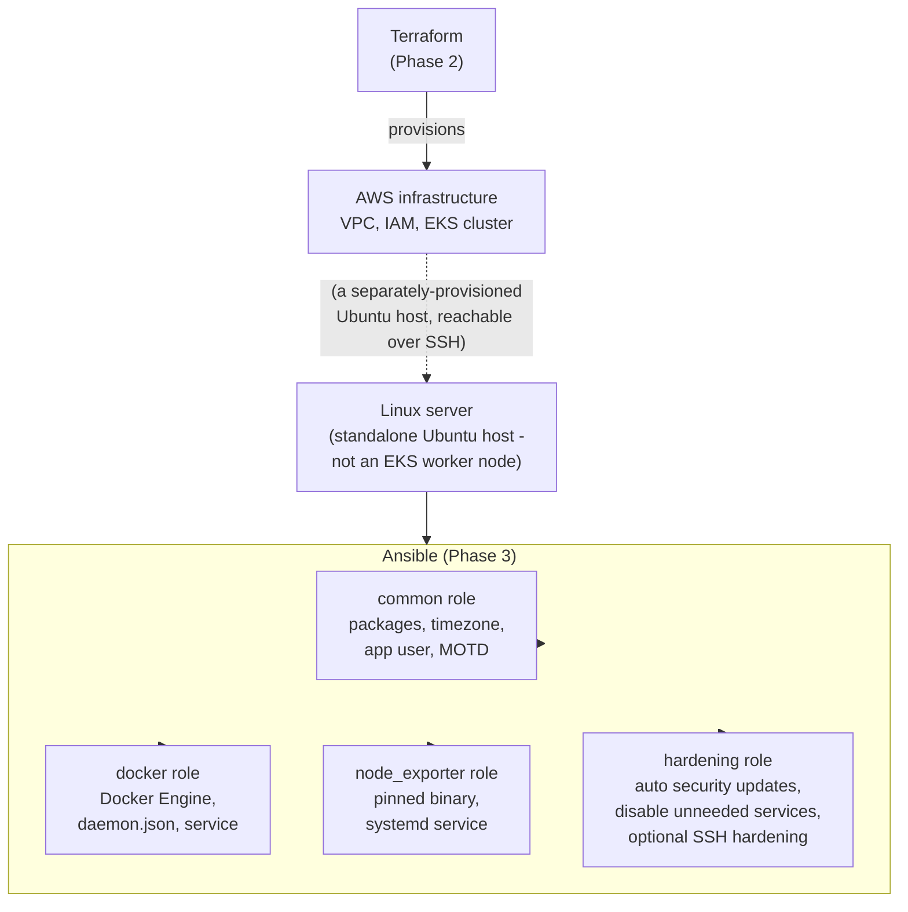

# Ansible architecture (Phase 3)

## Overview

Phase 2 (Terraform) provisions AWS infrastructure: networking, IAM, and an
EKS cluster. Phase 3 (this one) adds Ansible for a different job:
**configuring the operating system on a Linux server** — packages, a
timezone, an application user, Docker, Node Exporter, and basic security
hardening. These two tools are deliberately kept separate rather than
asking one of them to do both jobs; see
["Why Terraform and Ansible, not just one tool"](#why-terraform-and-ansible-not-just-one-tool)
below.

**Important scope note:** the Ansible roles in this repo target a
general-purpose Ubuntu server reachable over SSH (the `dev_servers` group
in `ansible/inventory/`) — for example a standalone EC2 instance, a home
lab VM, or a small bastion/monitoring host. **They do not configure the
EKS managed node group from Phase 2.** EKS worker nodes are provisioned
and patched by AWS itself (via the managed node group's own AMI/bootstrap
process); Ansible is never run against them in this repo. If a later
phase needs configuration management for something running on Kubernetes,
that becomes a Kubernetes-native concern (Helm values, DaemonSets, admission
policies), not an SSH+Ansible one.

## Architecture diagram



## Why Terraform and Ansible, not just one tool

Both *can* somewhat overlap (Terraform has `provisioner "remote-exec"`;
Ansible has cloud modules for creating infrastructure), but leaning on
either tool outside its strength causes real problems:

- **Terraform models desired-state infrastructure as a dependency graph**
  (this subnet needs that VPC, this node group needs that IAM role) and
  tracks it in state so it knows exactly what to create, change, or
  destroy. It is not designed to manage the day-to-day state of a running
  operating system — SSH-ing in, checking whether a package is installed,
  editing a config file — its resources are AWS/cloud-provider API calls,
  not shell commands against a live host.
- **Ansible models desired-state configuration of already-running
  machines**, re-checked and re-applied idempotently every time it runs
  (`ansible-playbook` twice in a row should report the second run as
  "changed=0" wherever nothing actually needs to change). It has no
  concept of a dependency graph or state file the way Terraform does, and
  deliberately doesn't try to "own" the infrastructure the machine runs
  on.
- Using `remote-exec` provisioners to configure servers from inside
  Terraform is a widely-documented anti-pattern: it re-runs on every
  `apply` whether or not configuration actually changed, has no real
  idempotency model, and ties configuration changes to infrastructure
  changes even when the two have nothing to do with each other (e.g.
  bumping `node_exporter_version` shouldn't require touching a VPC route
  table).

Splitting them keeps each tool doing only what it's actually good at, and
keeps the two failure domains (a bad `terraform apply` vs. a bad
`ansible-playbook` run) from ever being the same blast radius.

## Progression this repo is building toward

```
Terraform
   |
   v
AWS infrastructure (VPC, IAM, EKS - Phase 2)
   |
   v
Linux / compute (a standalone Ubuntu server - this phase's target)
   |
   v
Ansible configuration (this phase)
   |
   v
Docker / Node Exporter (installed by Ansible, running on that server)
   |
   v
Kubernetes / EKS (Phase 2's cluster - workloads not yet deployed onto it)
   |
   v
Helm + ArgoCD (future phase - GitOps delivery onto the EKS cluster)
   |
   v
Observability (future phase - Prometheus/Grafana/Loki/Alertmanager,
               scraping the /metrics endpoints and Node Exporter
               instances already in place)
```

Ansible's box in this diagram is intentionally *beside* the EKS cluster,
not inside it — it configures a separate class of host (plain Linux
servers), while Kubernetes workloads on EKS are configured through
Kubernetes-native mechanisms in later phases.

## Role responsibilities

| Role | Responsibility |
|---|---|
| `common` | Base OS setup: apt cache, base packages, timezone, application system user/group, application directories, an Ansible-managed MOTD banner. |
| `docker` | Installs Docker Engine (CE) from Docker's official APT repository, configures daemon-level log rotation, ensures the service is enabled/running, optionally adds the application user to the `docker` group. |
| `node_exporter` | Installs a pinned version of Prometheus Node Exporter as a dedicated-user systemd service, ready for a future observability phase to scrape. |
| `hardening` | Automatic security updates, disabling services a headless server doesn't need, and an **opt-in, off-by-default** SSH hardening drop-in (root login / password auth). |

See [ansible/README.md](../ansible/README.md) for variables, running the
playbooks, linting, and security considerations in full detail.

## Deliberately out of scope for Phase 3

- Deploying the TaskFlow application itself onto the configured server
  (this phase proves the server can run Docker/Node Exporter — it doesn't
  ship `docker-compose up` via Ansible).
- Any configuration of the EKS managed node group — see the scope note
  above.
- A full CIS/DISA-style hardening benchmark — `hardening` demonstrates
  the pattern (safe defaults, opt-in risky changes, `sshd -t` validation)
  on a handful of representative, genuinely safe checks, not exhaustive
  coverage.
- Ansible Vault in active use — no secret currently needs to be stored
  for these roles to run, so none is added just to demonstrate Vault. See
  [ansible/README.md](../ansible/README.md#ansible-vault-if-you-ever-need-it)
  for how it would be introduced if/when one is needed.
