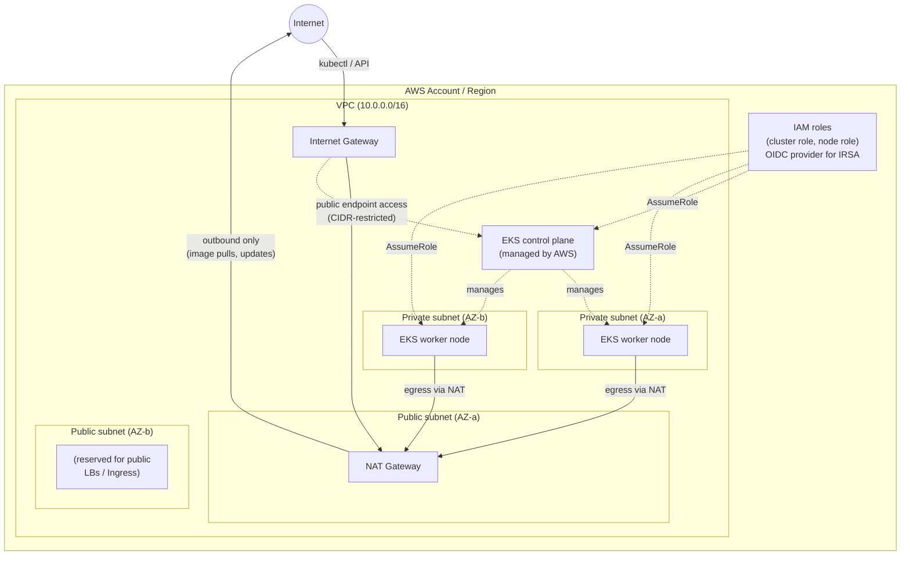

# AWS architecture (Phase 2)

## Overview

Phase 2 provisions the AWS infrastructure TaskFlow's Kubernetes manifests
(from Phase 1) will eventually run on: a VPC with public and private
subnets, an EKS cluster, and a managed node group for worker nodes. This
phase is infrastructure-only — Terraform defines and can provision the
cluster, but the Kubernetes manifests in [kubernetes/](../kubernetes/) are
not deployed onto it automatically. Wiring that up (via `kubectl apply` or,
later, GitOps) is a deliberate next step, not something `terraform apply`
does on its own.

## Architecture diagram

## Component breakdown

| Component | Purpose |
|---|---|
| VPC | Isolated network (`10.0.0.0/16` by default) all other resources live in. |
| Public subnets | Host the NAT gateway(s) and, in a later phase, internet-facing load balancers (tagged `kubernetes.io/role/elb`). No worker nodes run here. |
| Private subnets | Host EKS worker nodes exclusively. Tagged `kubernetes.io/role/internal-elb` for internal load balancers. |
| Internet Gateway | Gives public subnets a route to/from the internet. |
| NAT Gateway | Gives private subnets outbound-only internet access (image pulls, package updates) without exposing worker nodes to inbound traffic. |
| Route tables | One public route table (default route → IGW); one private route table per NAT gateway (default route → NAT). |
| IAM cluster role | Assumed by the EKS control plane (`eks.amazonaws.com`) — `AmazonEKSClusterPolicy` only. |
| IAM node role | Assumed by worker node EC2 instances (`ec2.amazonaws.com`) — the three AWS-managed policies EKS documents as required (worker node, CNI, ECR read-only). |
| OIDC provider | Registered against the cluster's own OIDC issuer so future phases can grant AWS permissions to individual Kubernetes service accounts (IRSA) instead of broadening the shared node role. |
| EKS cluster (control plane) | Fully managed by AWS; its ENIs span both subnet tiers. |
| EKS managed node group | The EC2 Auto Scaling group AWS manages on our behalf; instance type, disk size, and desired/min/max count are all configurable via Terraform variables. |

## Why worker nodes are in private subnets

Worker nodes never need an inbound path from the internet — the API server
(control plane) reaches them over the VPC's private address space, and the
only thing nodes themselves initiate outbound is image pulls, package
updates, and calls back to the control plane, all of which the NAT gateway
satisfies. Putting them in private subnets means:

- No worker node ever has a public IP or a security group rule that has to
  justify inbound internet access.
- A compromised or misconfigured pod can't be reached directly from the
  internet — it has to go through whatever Kubernetes Service/Ingress
  explicitly exposes it (and those, when needed, get public IPs of their
  own via the public subnets — not the nodes).
- It matches how production EKS clusters are run in practice; "nodes in
  private subnets, control plane API optionally public" is the standard,
  documented AWS reference architecture.

## Why Terraform modules

The three modules (`vpc`, `iam`, `eks`) each own one clearly-scoped piece of
infrastructure with a small, typed interface (variables in, outputs out).
This buys:

- **Reuse without copy-paste.** `environments/dev` composes all three
  modules today; a `staging` or `prod` environment would call the same
  three modules with different variable values, not a second copy of the
  resource definitions.
- **A blast radius that matches the code you're reading.** Changing subnet
  CIDR logic means editing `modules/vpc`, not hunting through one large
  file that also defines IAM and EKS resources.
- **Explicit contracts between layers.** The EKS module doesn't know or
  care how the VPC module built its subnet list — it just takes
  `private_subnet_ids` as an input. That mirrors the same decoupling this
  repo's microservices already demonstrate at the application layer (see
  [docs/architecture.md](architecture.md)).

## Deliberately out of scope for Phase 2

- Deploying the Kubernetes manifests from [kubernetes/](../kubernetes/)
  onto the cluster (kubectl apply or GitOps) — a later phase.
- A managed database (RDS) — Postgres still runs as a Kubernetes workload,
  per the Phase 1 manifests.
- DNS, TLS/ingress, and a load balancer controller — Phase 6.
- Any IRSA role beyond the OIDC provider itself — added as specific
  controllers (e.g. AWS Load Balancer Controller) are introduced.
- Terraform remote state backend — local state is used by default; see
  `terraform/environments/dev/backend.tf` for a commented S3+DynamoDB
  example to switch to for team/CI use.

See the root [README](../README.md) for how to initialize, plan, and
(manually) apply this configuration, plus cost and security
considerations.
