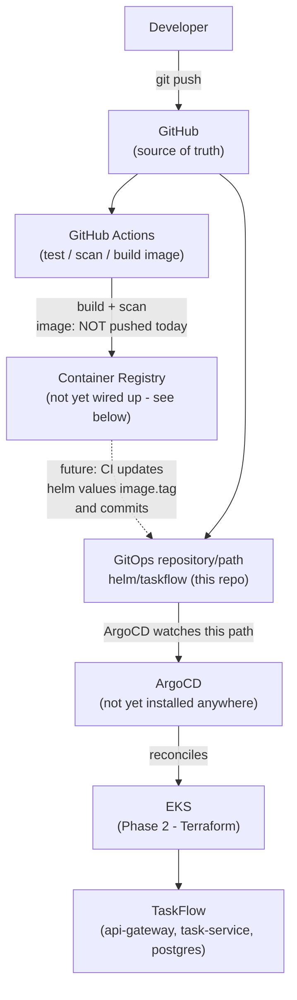

# GitOps architecture (Phase 4)

## Overview

Phase 2 (Terraform) provisions AWS infrastructure; Phase 3 (Ansible)
configures standalone Linux servers. Phase 4 answers a different
question: **how does the TaskFlow application itself get onto the EKS
cluster, and stay there in the state Git says it should be in?** The
answer is Helm (packaging/templating) + ArgoCD (GitOps reconciliation).

**What's actually implemented vs. documented:** the Helm chart
(`helm/taskflow/`) and ArgoCD manifests (`argocd/`) are real and
validated (see [helm/taskflow/README.md](../helm/taskflow/README.md) and
[argocd/README.md](../argocd/README.md) for exactly which commands were
run). What is **not** implemented: no image has been pushed to a real
registry, ArgoCD has not been installed anywhere, and nothing has been
deployed to the real EKS cluster from Phase 2. This document is explicit
about that line throughout.

## End-to-end flow



The dotted line is the one piece that's designed-for but not
implemented: pushing to a real registry and having CI write the new tag
back into `helm/taskflow/values-*.yaml` (or a separate GitOps overlay)
as a commit. See
["What's next: closing the loop"](#whats-next-closing-the-loop) below.

## Helm

Helm packages the Kubernetes manifests Phase 1 wrote by hand
(`kubernetes/`) into a templated, versioned, parameterized chart
(`helm/taskflow/`). Concretely, that means: one `image.tag` value instead
of hand-editing every Deployment when the app version changes, one
`values-dev.yaml` vs. `values-prod.yaml` instead of maintaining two full
copies of every manifest, and `helm template`/`helm lint` giving fast,
offline feedback on a change before it ever reaches a cluster.

## ArgoCD / GitOps

ArgoCD runs inside a cluster and continuously compares:

- **Desired state**: what's declared in this Git repo (a specific commit
  of `helm/taskflow`, rendered with a specific values file)
- **Live state**: what's actually running in the `taskflow` namespace

When these diverge, ArgoCD's dashboard (and CLI/API) shows the app as
`OutOfSync`. With automated sync enabled (as this repo's dev `Application`
does - see `argocd/application-dev.yaml`), ArgoCD also **reconciles**: it
applies whatever changed in Git, and - because `selfHeal: true` - reverts
any change made directly against the cluster back to what Git says.

This is the core GitOps principle: **Git is the source of truth, not the
cluster.** A `kubectl edit` against a GitOps-managed resource is not a
permanent change - it's a drift that gets corrected on the next
reconciliation (default: every ~3 minutes, or immediately on a Git
webhook/poll).

### Drift detection

"Drift" is any difference between Git and the live cluster - a manual
`kubectl scale`, a change from a different tool, or someone editing a
ConfigMap by hand. ArgoCD detects this continuously (it's what `OutOfSync`
means) whether or not `selfHeal` is on; `selfHeal: true` is what makes it
also **correct** drift automatically instead of just reporting it.

### Auditability

Because every desired-state change is a Git commit, the Git history of
`helm/taskflow/` and `argocd/` **is** the change log for what's been
deployed and when - who changed what, reviewed via a pull request, at
what commit SHA. ArgoCD's own sync history (`argocd app history`) then
ties each deployed revision back to that same Git commit.

### Rollback

Because Git is the source of truth, rolling back is a Git operation, not
a cluster operation:

```
git revert <bad commit>
   |
   v
ArgoCD detects the new desired state (different from what's live)
   |
   v
ArgoCD reconciles (applies the reverted values/templates)
   |
   v
Previous application/chart version is restored
```

`argocd app rollback` (choosing a prior sync from `argocd app history`) is
the equivalent one-step ArgoCD-native operation, though a `git revert`
composed with a PR is the more GitOps-idiomatic path since it leaves the
same audit trail every other change does. Neither of these was exercised
in this phase - no ArgoCD was installed, and no `helm install` was run
against any cluster either. See
[argocd/README.md](../argocd/README.md#rollback) for what that leaves as
documented-but-untested, and the root Phase 4 summary for exactly what
validation was performed instead (`helm lint`/`helm template`).

### Environment values

`values-dev.yaml` and `values-prod.yaml` are not two different charts -
they're two different **inputs** to the same templates, which is the
point: the exact same Deployment/Service/StatefulSet template logic runs
in both, and the only thing that differs between environments is data
(replica counts, resource sizing, which secret to use), not code. See
[helm/taskflow/README.md](../helm/taskflow/README.md#values) for what
differs between them.

## What's next: closing the loop

The one piece of the diagram above that's intentionally not implemented:
a CI step that pushes the built image to a real registry (e.g. GHCR,
using the repo's own built-in `GITHUB_TOKEN` - no long-lived credentials
needed) and then commits an updated `image.tag` back into
`helm/taskflow/values-dev.yaml` (or a dedicated GitOps overlay file), for
ArgoCD to pick up automatically. This wasn't added in this phase because:
it requires deciding on and provisioning a real registry, it starts CI
writing commits back into `main` (a bigger, higher-blast-radius change
than build+scan), and per this phase's own constraints, nothing here
should start deploying to real infrastructure automatically. Documenting
the shape of that step here, rather than fabricating registry credentials
to "complete" it, is the honest way to leave it for a deliberate future
phase.

## Related documentation

- [helm/taskflow/README.md](../helm/taskflow/README.md) - chart
  structure, values, installation, linting, templating, troubleshooting.
- [argocd/README.md](../argocd/README.md) - installing ArgoCD, creating
  the project/application, sync behavior, rollback.
- [docs/aws-architecture.md](aws-architecture.md) - the EKS cluster this
  would eventually run on (Phase 2).
- [docs/ansible-architecture.md](ansible-architecture.md) - how Ansible
  (Phase 3) relates to (and is scoped separately from) this phase.
