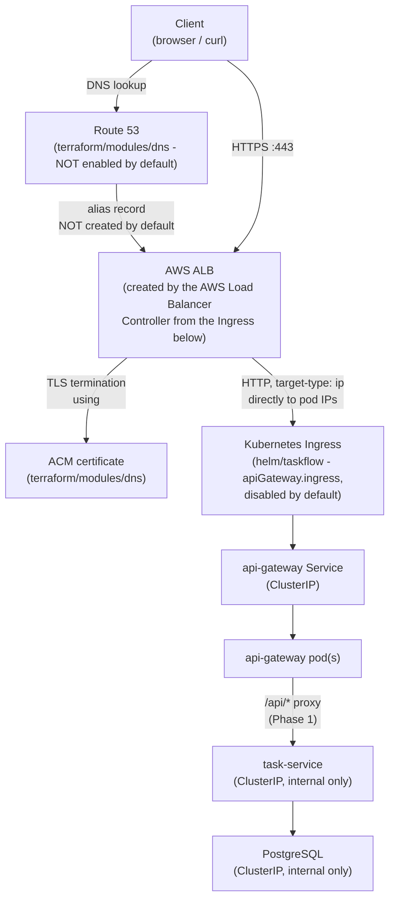
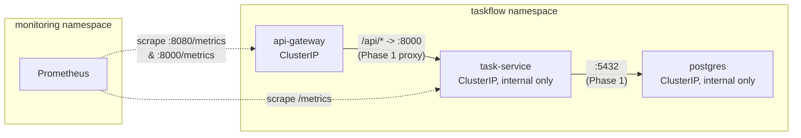
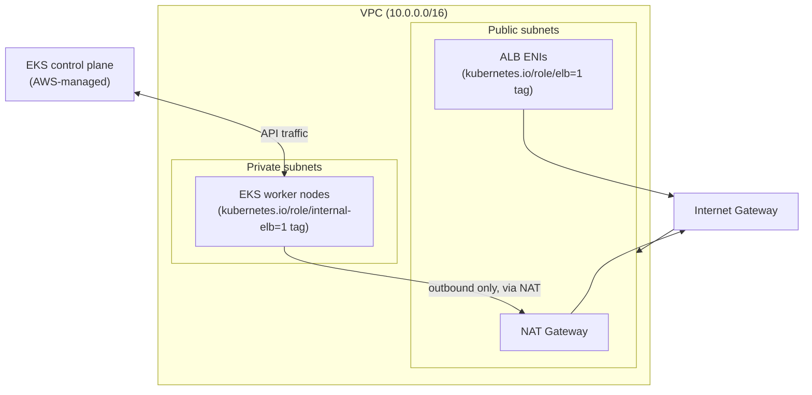
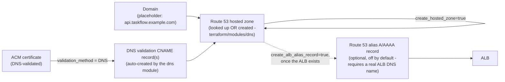
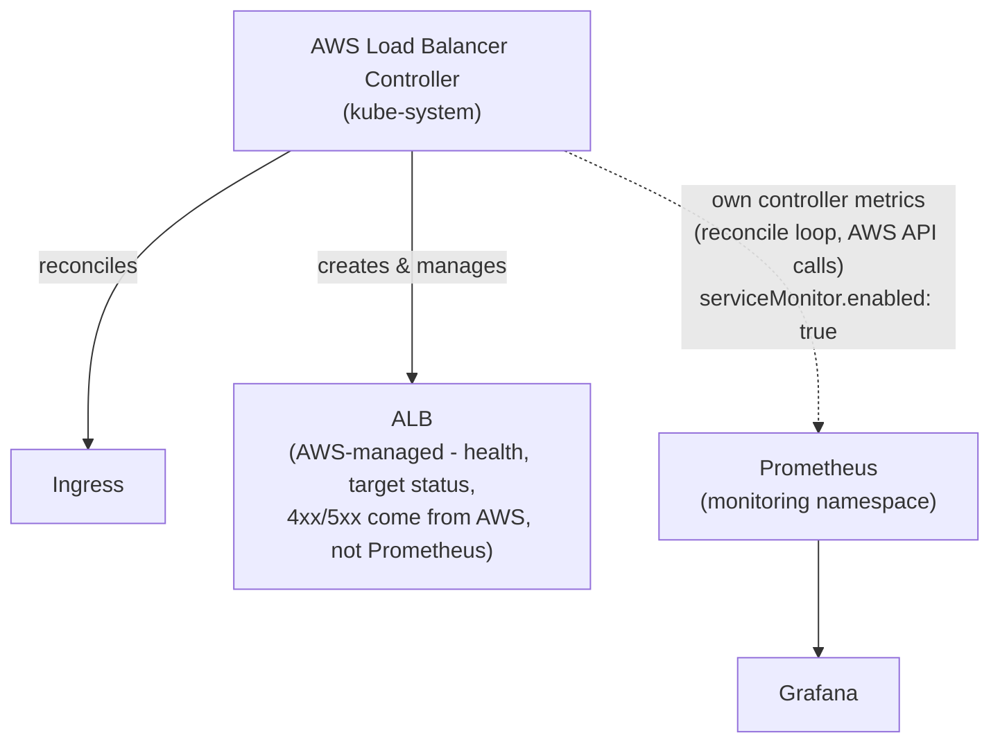
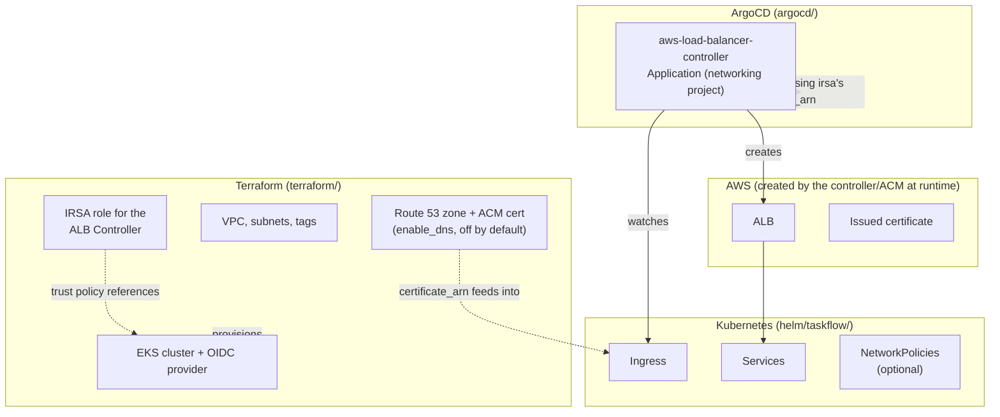

# Networking architecture (Phase 6)

## Overview

Phases 1-5 built the application, packaged it (Helm/ArgoCD), and made it
observable. Phase 6 answers the remaining question: **how does traffic
from the public internet actually reach TaskFlow, over HTTPS, and how
would someone troubleshoot it when it doesn't?**

**What's actually implemented vs. documented:** every Terraform module
(`terraform/modules/irsa/`, `terraform/modules/dns/`), Helm value
(`networking/aws-load-balancer-controller/values-dev.yaml`,
`helm/taskflow`'s new `apiGateway.ingress.*` / `global.networkPolicy.*`
keys), and ArgoCD manifest (`argocd/networking-project.yaml`,
`argocd/application-dev-aws-load-balancer-controller.yaml`) below is real
and was validated locally (see the Phase 6 implementation summary for
exact commands/results: `terraform validate`, `helm lint`/`helm
template`, `kubeconform` against real CRD schemas). What is **not**
implemented: no ALB has ever been created, no DNS record resolves
anywhere, no ACM certificate has been issued, and no request has ever
actually reached api-gateway from the internet. This document is explicit
about that line throughout, the same way
[docs/observability-architecture.md](observability-architecture.md) is
for Phase 5.

## 1. External request path



Client → Route 53 → ALB → TLS termination → Ingress → api-gateway →
task-service → PostgreSQL, exactly as scoped. Every arrow after "Route 53"
is real, validated *configuration* - none of it has been exercised
against a real domain, certificate, or cluster.

## 2. Internal service communication



Unchanged from Phase 1/5: api-gateway proxies to task-service, task-service
talks to Postgres, Prometheus scrapes both. Phase 6 adds nothing new
*inside* the cluster except the optional NetworkPolicies
(`helm/taskflow/templates/networkpolicy.yaml`) that make this exact,
already-existing traffic pattern the only traffic pattern the cluster's
CNI will permit - see [Network Policies](#network-policies) below.

## 3. AWS VPC architecture



This is entirely **Phase 2's existing design, unchanged** -
`terraform/modules/vpc/main.tf` already tags public subnets
`kubernetes.io/role/elb=1` and private subnets
`kubernetes.io/role/internal-elb=1` specifically so the AWS Load Balancer
Controller (this phase) can discover them, and
`docs/aws-architecture.md` already said "DNS, TLS/ingress, and a load
balancer controller — Phase 6" before this phase existed. Worker nodes
still never get a public IP; the ALB is the only thing in this diagram
that's actually reachable from the internet.

## 4. DNS/TLS relationship



**The chicken-and-egg problem this diagram makes explicit:** the ACM
certificate can be created and DNS-validated *before* any Ingress/ALB
exists (validation only needs the domain's own DNS, not the ALB). The
final alias record pointing the domain *at* the ALB can only be created
*after* the AWS Load Balancer Controller has actually provisioned that
ALB from a real Ingress - which is why `create_alb_alias_record` defaults
to `false` and takes the ALB's DNS name as a variable rather than
computing it automatically. See
[terraform/modules/dns/main.tf](../terraform/modules/dns/main.tf)'s own
header comment.

## 5. Monitoring relationship



Only the **controller's own** health (is it successfully reconciling
Ingresses, is it hitting AWS API rate limits) is scraped by Prometheus
here (`networking/aws-load-balancer-controller/values-dev.yaml`'s
`serviceMonitor.enabled: true`). The **ALB's own** operational metrics
(target health, request count, latency, 4xx/5xx at the load-balancer
layer) live in AWS/CloudWatch, a genuinely different system this project
does not integrate with - see
[Ingress observability](#ingress-observability) below for exactly which
metrics come from which source.

## 6. Terraform vs. ArgoCD ownership



**Ownership is deliberately non-overlapping:**

| Layer | Owns |
|---|---|
| **Terraform** | AWS infrastructure that has real state and a slow/expensive lifecycle: the VPC, the EKS cluster, IAM/IRSA roles, and (opt-in) the Route 53 zone/ACM certificate. |
| **ArgoCD** | Kubernetes-native controllers and application manifests: the AWS Load Balancer Controller itself, and the `Ingress`/`Service`/`NetworkPolicy` objects `helm/taskflow` defines. |
| **AWS (at runtime, not Terraform)** | The ALB itself and the issued certificate's actual validation state - both are *created* by controllers/services Terraform+ArgoCD configure, not by a `aws_lb`/`aws_acm_certificate` resource Terraform manages directly for the ALB. |
| **Kubernetes** | Routing (`Ingress` rules), service discovery (`Service` objects), and (optional) traffic policy (`NetworkPolicy`) - all declarative, all in Git via `helm/taskflow`. |

This mirrors exactly the same principle
[docs/technology-decisions.md](technology-decisions.md#why-separate-terraform-from-application-deployment)
already established for Terraform vs. Helm in Phase 4: infrastructure
with a slow, expensive lifecycle stays in Terraform's state; anything
that's really "application configuration" (even cluster-level controller
configuration) goes through GitOps instead.

## Monitoring stays internal

Introducing external Ingress for `api-gateway` does not change anything
about how the observability stack (Prometheus, Grafana, Loki,
Alertmanager - Phase 5) is reached: it has no Ingress of its own, its
Services remain `ClusterIP`, and `argocd/observability-project.yaml`'s
destination namespace (`monitoring`) is entirely separate from
`argocd/networking-project.yaml`'s (`kube-system`) and `argocd/project.yaml`'s
(`taskflow`) - no Application in this repo can reach across those
boundaries. Reaching Grafana/Prometheus still means `kubectl
port-forward`, exactly as in Phase 5 - see
[observability/README.md#security](../observability/README.md#security).

## Kubernetes service exposure

Every TaskFlow Service (`api-gateway`, `task-service`, `postgres`) is
`ClusterIP` - **none** use `NodePort`, and only `api-gateway` is reachable
from outside the cluster at all, and only via the Ingress:

```
ClusterIP -> Ingress -> ALB -> Internet
```

vs. the alternative this project deliberately avoids:

```
LoadBalancer Service (one ELB/NLB per Service) -> Internet
```

**Why one Ingress/ALB instead of a `LoadBalancer`-type Service per
component:** a `LoadBalancer` Service provisions its *own* separate load
balancer - three externally-reachable Services would mean three separate
ELBs/NLBs, three sets of security groups, three TLS certificates to
manage, and three DNS records, none of which coordinate with each other.
An Ingress in front of one shared ALB centralizes TLS termination, routing
rules, and cost into a single, reviewable resource - and, just as
importantly, makes it structurally impossible to *accidentally* expose
`task-service` or `postgres` externally, since neither has (or needs) its
own `LoadBalancer` Service to misconfigure. `NodePort` is avoided
entirely: it would expose a port on every worker node's own IP (nodes
have no public IP in this VPC design - see [AWS VPC
architecture](#3-aws-vpc-architecture) above) and offers no TLS
termination, health-check integration, or routing-rule capability the
ALB+Ingress combination doesn't already provide better.

## AWS Load Balancer Controller

Deployed via the `eks/aws-load-balancer-controller` Helm chart (pinned
`3.5.0`, verified current at the time this file was written), into
`kube-system`, using the IRSA role `terraform/modules/irsa` creates
(`terraform/environments/dev/main.tf`'s
`aws_load_balancer_controller_irsa` module call) - **reusing** the OIDC
provider `terraform/modules/eks` already registers in Phase 2, not a new
one. See [networking/aws-load-balancer-controller/values-dev.yaml](../networking/aws-load-balancer-controller/values-dev.yaml)
for the full values and
[argocd/README.md#observability-applications](../argocd/README.md#observability-applications)
for the multi-source Application pattern this reuses from Phase 5.

**Least privilege:** the IAM policy attached to this role is AWS's own
[officially published policy](https://raw.githubusercontent.com/kubernetes-sigs/aws-load-balancer-controller/v3.5.0/docs/install/iam_policy.json)
for this exact controller version, fetched verbatim rather than
constructed by hand - see `terraform/environments/dev/policies/`. No
`cluster-admin`, no IAM user, no long-lived access key anywhere in this
chain.

**What's statically validated vs. what needs a real cluster:** the
Terraform (IRSA role), the Helm values, and the ArgoCD Application are all
real and validated (`terraform validate`, `helm template`, `kubeconform`).
Installing the controller, having it actually create an ALB, and
confirming the ALB routes real traffic all require a real EKS cluster and
were not performed - see the Phase 6 implementation summary.

## Ingress

`helm/taskflow/templates/ingress.yaml`, rendered only when
`apiGateway.ingress.enabled: true` (default `false`). Key decisions:

- **`alb.ingress.kubernetes.io/target-type: ip`** - the ALB targets pod
  IPs directly (via the VPC CNI), matching this chart's existing
  `ClusterIP` Services exactly. The alternative, `target-type: instance`,
  would route through each node's `NodePort` instead - unnecessary given
  every pod IP is already directly routable in this VPC design.
- **`ingressClassName: alb`** (not the deprecated
  `kubernetes.io/ingress.class` annotation) - the modern, spec-level way
  to select a controller, and the `IngressClass` named `alb` is created
  automatically by the controller's own chart
  (`createIngressClassResource: true`, its default), not by anything in
  this repo.
- **Health check reuses `/health`** (Phase 1's liveness endpoint) rather
  than inventing a separate check - see `apiGateway.ingress.healthCheckPath`.
- **Timeout considerations (not configured, documented here instead):**
  the ALB's default idle timeout is 60 seconds; a request/response taking
  longer than that gets cut off at the load balancer regardless of
  what the pod is still doing. None of TaskFlow's endpoints are expected
  to run anywhere near that long, so this is left at the chart/AWS
  default rather than tuned - a real production Ingress carrying
  long-running requests would set `alb.ingress.kubernetes.io/load-balancer-attributes: idle_timeout.timeout_seconds=<value>`
  explicitly instead of relying on the default.

## DNS / Route 53

`terraform/modules/dns` (see [DNS/TLS relationship](#4-dnstls-relationship)
above for the bootstrapping order). Not instantiated by default in
`terraform/environments/dev` (`enable_dns = false`) - every resource it
creates needs a domain this project doesn't actually own. `domain_name`
defaults to the placeholder `api.taskflow.example.com`, matching this
phase's own example throughout; **no real domain was purchased or assumed
to exist**, and no real DNS record was ever created.

## TLS / ACM

```
Client --HTTPS--> ALB --TLS termination--> (plain HTTP) --> Kubernetes Service
```

- **Where TLS terminates:** at the ALB, not at the Ingress/pod. This is
  the standard, AWS-recommended pattern for this controller -
  `alb.ingress.kubernetes.io/certificate-arn` tells the ALB itself which
  ACM certificate to present, and `backend-protocol: HTTP` means traffic
  from the ALB to the pod is plain HTTP.
- **Why terminate there:** ACM certificates are usable *only* by AWS
  services that integrate with ACM directly (ALB/CloudFront/etc.) - ACM
  never hands out the private key itself, by design. Terminating anywhere
  else (the pod) would mean managing a separate certificate/private key
  pair ourselves, with our own renewal process, which is exactly the
  operational burden ACM exists to remove.
- **HTTP -> HTTPS redirect:** `alb.ingress.kubernetes.io/ssl-redirect:
  "443"` plus the `listen-ports` annotation listening on both 80 and 443 -
  the ALB itself issues the redirect before a plain-HTTP request ever
  reaches the cluster.
- **Certificate renewal:** ACM automatically renews certificates it
  manages, provided the DNS validation records
  (`terraform/modules/dns`'s `aws_route53_record.cert_validation`) remain
  in place - this is exactly why that module creates them as real,
  managed resources rather than a one-time manual step.
- **Why no private key is ever in Git:** ACM never exposes the private
  key for a certificate it issues - there is no key to accidentally
  commit. This is a structural property of using ACM rather than a
  policy this project has to remember to follow.

## Network Policies

`helm/taskflow/templates/networkpolicy.yaml`, rendered only when
`global.networkPolicy.enabled: true` (default `false`). Implements
exactly the flow diagrammed in [Internal service
communication](#2-internal-service-communication) above as a *default
deny except this* policy per component (api-gateway, task-service,
postgres), including explicit DNS-egress allowances (a NetworkPolicy with
any `Egress` rule blocks all other egress by default, DNS included - one
of the most common ways a NetworkPolicy accidentally breaks a workload
instead of just securing it).

**Why this defaults to disabled - the CNI-enforcement assumption:**
NetworkPolicy is a Kubernetes API object, but *enforcing* it is entirely
up to the cluster's CNI plugin. The default Amazon VPC CNI (what
`terraform/modules/eks` provisions, unmodified) does **not** enforce
NetworkPolicy unless its NetworkPolicy support is explicitly enabled (a
CNI add-on configuration this Terraform does not set), or an alternative
like Calico is installed instead. Enabling `global.networkPolicy.enabled`
on a cluster that doesn't enforce it is not a security improvement - it's
a silent no-op, indistinguishable from having no policy at all until
someone actually tests it. This project makes that assumption explicit
rather than either skipping NetworkPolicy entirely or shipping it
enabled-by-default with an implied (and possibly false) guarantee.

## Ingress observability

Metrics relevant to the external request path come from three genuinely
different sources - conflating them would misattribute a failure:

| Metric | Source | Notes |
|---|---|---|
| ALB target health, request count, latency, 4xx/5xx *at the load balancer* | **AWS** (CloudWatch) | Not scraped by Prometheus in this project - would require the CloudWatch exporter or AWS's own dashboards, neither set up here. |
| Controller reconciliation health, AWS API call counts/errors | **Kubernetes + the controller itself** | *Is* scraped by Prometheus - `networking/aws-load-balancer-controller/values-dev.yaml`'s `serviceMonitor.enabled: true`. |
| `Ingress` object status (`.status.loadBalancer`), whether the controller has successfully reconciled it | **Kubernetes** | Visible via `kubectl get ingress`/`kubectl describe ingress`, not a Prometheus metric in this project. |
| Application-level traffic/errors/latency actually reaching api-gateway | **Application** (task-service and api-gateway's own `/metrics`) | Already covered end-to-end - see [docs/observability-architecture.md#golden-signals](observability-architecture.md#golden-signals). |

No AWS/ALB-native metric (target health, ALB-layer 4xx/5xx, ALB latency)
is invented or assumed scraped in this project - the golden-signal
dashboards and alerts from Phase 5/6 measure the *application's own*
view of traffic/errors/latency, not the load balancer's.

## Production vs. portfolio

What's implemented here is a complete, coherent **single-AZ-aware,
single-ALB, single-domain** design appropriate for a portfolio
environment. A real production deployment would additionally consider
(none of this is implemented - see the root README's roadmap):

- **Multiple AZs / multiple ALBs** if a single region's AZ failure
  shouldn't take down the entry point (an ALB is already
  multi-AZ-capable within one region by default; this becomes relevant
  at a multi-region scale).
- **AWS WAF** in front of the ALB for request filtering (rate limiting,
  common exploit signatures) - `alb.ingress.kubernetes.io/wafv2-acl-arn`
  is the annotation that would wire it in.
- **AWS Shield** for DDoS protection beyond what's included by default.
- **DNS failover** (Route 53 health checks + failover routing policy) if
  there's a secondary region/environment to fail over to.
- **`external-dns`** to automate the alias-record step
  `terraform/modules/dns`'s `create_alb_alias_record` currently leaves
  manual/opt-in - `external-dns` watches Ingress objects and creates/
  updates Route 53 records automatically as the ALB's DNS name becomes
  known, closing the chicken-and-egg gap this document describes in
  [DNS/TLS relationship](#4-dnstls-relationship).
- **Automated certificate rotation across environments**, Pod Security
  Standards, centralized ALB access logs into the existing Loki/S3
  pipeline, and CloudWatch integration for the AWS-native metrics table
  above - all natural extensions, none implemented here to avoid building
  infrastructure this project can't actually exercise or verify.

See [docs/observability-runbook.md](observability-runbook.md) for
application/cluster troubleshooting and
[docs/networking-troubleshooting-runbook.md](networking-troubleshooting-runbook.md)
for the networking-specific procedures this phase adds.
