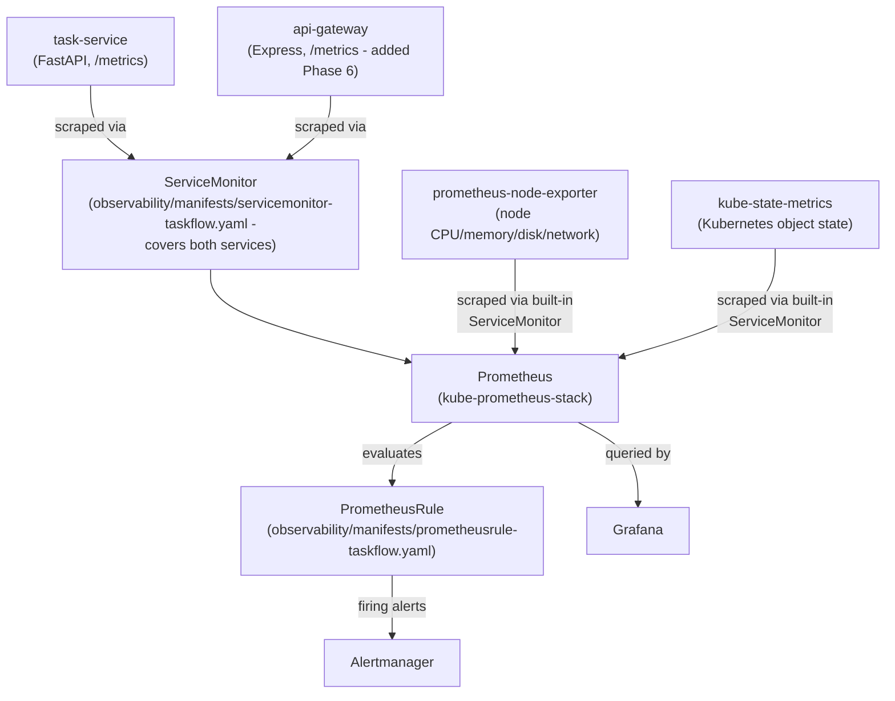
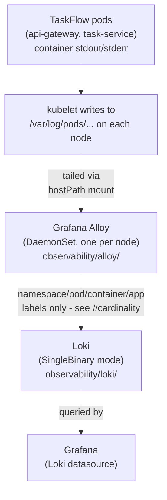

# Observability architecture (Phase 5)

## Overview

Phases 2-4 provisioned infrastructure (Terraform/EKS), configured servers
(Ansible), and packaged/delivered the application (Helm/ArgoCD). Phase 5
answers a different question: **once TaskFlow is running, how would anyone
know whether it's actually working, and how would they start
troubleshooting when it isn't?**

**What's actually implemented vs. documented:** every Helm values file,
plain Kubernetes manifest, alert rule, and dashboard under
[observability/](../observability/) and [argocd/](../argocd/) is real and
was validated locally (see the Phase 5 implementation summary for the
exact commands and results: `helm template` against the real pinned chart
versions, `promtool check rules`, `alloy validate`, JSON/YAML validation,
and the full task-service test suite).

**Update (Phase 7):** this entire stack has since been deployed onto a
real local Kubernetes cluster (Docker Desktop) and confirmed working at
runtime - Prometheus really did scrape both services, alerts really did
transition to `firing` during incident simulations and really did reach
Alertmanager, and logs really did flow through Alloy into Loki. See
[docs/local-runtime-validation.md](local-runtime-validation.md) for the
full evidence, including two real bugs this exact stack's config had that
only a real deployment surfaced. What remains unvalidated is the AWS
side specifically - no EKS cluster was used, matching
[docs/local-runtime-validation.md#aws-runtime-limitations](local-runtime-validation.md#aws-runtime-limitations).
This document is otherwise unchanged from how Phase 5 wrote it, the same way
[docs/gitops-architecture.md](gitops-architecture.md) is for Phase 4.

## Metrics flow

## Logs flow

## Golden signals

The four signals every SRE-oriented dashboard/alert set is organized
around, mapped to what TaskFlow actually exposes (not aspirational
metrics - see `services/task-service/app/main.py`'s
`record_request_metrics` middleware, added in this phase specifically to
make this mapping real instead of partial):

| Signal | task-service metric | api-gateway metric | Query shape |
|---|---|---|---|
| **Traffic** | `task_service_http_requests_total` | `api_gateway_http_requests_total` | `sum(rate(...[5m])) by (path)` |
| **Errors** | `task_service_http_requests_total{status_code=~"5.."}` | `api_gateway_http_requests_total{status_code=~"5.."}` | 5xx / total ratio |
| **Latency** | `task_service_http_request_duration_seconds_bucket` | `api_gateway_http_request_duration_seconds_bucket` | `histogram_quantile(0.95, ...)` |
| **Saturation** | `container_cpu_usage_seconds_total`, `container_memory_working_set_bytes`, `kube_deployment_status_replicas_available` (both services, `namespace="taskflow"`) | | resource usage + replica availability |

Before Phase 5, only task-service's `/health` and `/ready` were
instrumented (a narrow `task_service_requests_total` counter covering two
endpoints, not the actual `/tasks` CRUD routes) - meaning traffic, errors,
and latency for the application's real business endpoints did not exist
as metrics at all. Phase 5's generic HTTP middleware
(`services/task-service/app/main.py`) covers every task-service route
uniformly, labeled by route *template* (`/tasks/{task_id}`) rather than
resolved path - see
[observability/README.md#cardinality](../observability/README.md#cardinality).

**api-gateway** had no `/metrics` endpoint at all through Phase 5; Phase 6
added the same golden-signal shape to it
(`services/api-gateway/src/app.js`'s equivalent middleware). Because
api-gateway proxies to task-service without Express route definitions of
its own for those upstream routes, it uses a *best-effort* path-template
heuristic instead (collapsing UUID/numeric path segments to `:id`) rather
than reading a true route template - see that file's own comment for why
the two services' instrumentation isn't identical even though the metric
shapes match.

## What kube-state-metrics is (and isn't)

`kube-state-metrics` reports **Kubernetes object state** - the same
information `kubectl get` would show, turned into metrics: how many
replicas a Deployment *wants* vs. *has available*
(`kube_deployment_spec_replicas` / `kube_deployment_status_replicas_available`),
whether a pod's readiness condition is true or false
(`kube_pod_status_ready`), how many times a container has restarted
(`kube_pod_container_status_restarts_total`).

It does **not** report actual resource usage - no CPU seconds, no memory
bytes. That's `container_cpu_usage_seconds_total` /
`container_memory_working_set_bytes`, which come from **cAdvisor** (built
into the kubelet, scraped directly by kube-prometheus-stack's Prometheus,
not via kube-state-metrics at all). The
[kubernetes-overview](../observability/grafana/dashboards/kubernetes-overview.json)
dashboard deliberately mixes both sources in one place and its own
description says so, precisely so this distinction doesn't get papered
over.

## Node monitoring: two different mechanisms

This project now has **two** separate ways a "node" gets monitored, and
they are not the same mechanism serving two audiences - they're genuinely
different tools for genuinely different targets:

1. **A standalone Linux server**, configured by
   [ansible/roles/node_exporter/](../ansible/roles/node_exporter/) (Phase
   3) - installs a pinned Node Exporter binary as a systemd service
   directly on the host. This is for the general-purpose Ubuntu server
   Ansible targets (a bastion/monitoring host), which is **not** part of
   the EKS cluster.
2. **EKS worker nodes**, monitored by kube-prometheus-stack's bundled
   `prometheus-node-exporter` subchart - runs as a DaemonSet, one pod per
   node, entirely inside Kubernetes. AWS provisions and patches these
   nodes (Phase 2's managed node group); nothing in `ansible/` is ever run
   against them (see
   [docs/ansible-architecture.md](ansible-architecture.md)'s own scope
   note, unchanged by this phase).

Both ultimately expose the same Node Exporter metric names
(`node_cpu_seconds_total`, `node_memory_MemAvailable_bytes`, etc.) because
both run the same underlying exporter - but installed, run, and scraped by
completely different mechanisms for completely different targets. The
[node-overview](../observability/grafana/dashboards/node-overview.json)
dashboard queries the Kubernetes-node instances (via kube-prometheus-stack's
own ServiceMonitor for the DaemonSet) - it does not, and structurally
cannot, see the standalone Ansible-managed server unless that server were
also added as a separate Prometheus scrape target (not done in this
phase).

## SLO thinking (example)

These are **portfolio examples of the concept**, not tested or claimed
commitments about TaskFlow's actual behavior - there is no real traffic
history to derive a defensible number from. A real SLO is set from
observed baselines and a genuine stakeholder conversation about acceptable
risk, not picked in the abstract.

- **Availability SLO (example):** 99% of `task-service` requests over a
  rolling 30-day window return a non-5xx status. Query shape:
  `1 - (sum(increase(task_service_http_requests_total{status_code=~"5.."}[30d])) / sum(increase(task_service_http_requests_total[30d])))`.
- **Latency SLO (example):** 95% of requests complete in under 1 second.
  Query shape: the same `histogram_quantile(0.95, ...)` used in
  `TaskServiceHighLatency` (see
  [observability/manifests/prometheusrule-taskflow.yaml](../observability/manifests/prometheusrule-taskflow.yaml)),
  evaluated over a longer window for SLO reporting rather than alerting.

The alert thresholds actually shipped (5%/25% error rate, 1s p95 latency -
see the PrometheusRule above) are deliberately **more permissive early
warnings**, not the SLO thresholds themselves; a real SLO-based alerting
setup (multi-window, multi-burn-rate alerts) is a further refinement this
phase doesn't implement, to avoid overengineering a project with no real
traffic to tune it against.

## Namespace

The entire observability stack (Prometheus, Grafana, Alertmanager, Loki,
Alloy) is deployed into a dedicated `monitoring` namespace, kept separate
from the `taskflow` namespace the application itself runs in (see
[helm/taskflow/README.md](../helm/taskflow/README.md)) - a monitoring
stack failure or a misconfigured RBAC change here has no ability to affect
the application namespace, and vice versa. See
[observability/README.md](../observability/README.md) for the full
directory layout and every values file's own reasoning.
